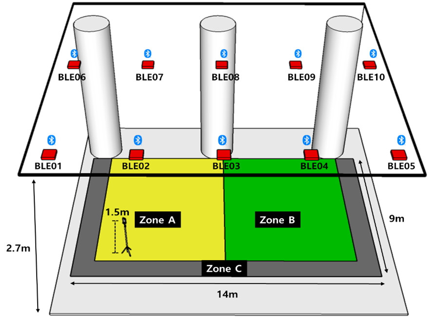
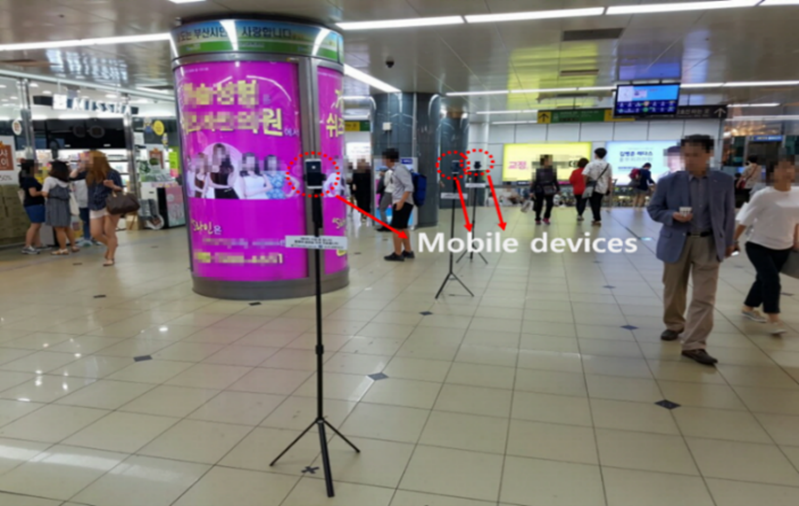

# Indoor Subway Station Setup and Data Collection

 
To verify the indoor zone estimation model, a virtual rectangular experimental area (width: 14 m, height: 9 m) was set up at the Seomyeon station in Busan, South Korea, and the user location is divided into three virtual zones: A, B, and C. As shown in station figure, 10 beacons (red boxes) were installed at equal intervals on the ceiling of height 2.7 m. A radio map constructed the RSSI signal data, measured from 105 reference points in the three designated virtual zones. 
  

 
A scanner (mobile device) placed with respect to each reference point acquired the RSSI data transmitted from the 10 BLE beacons. In practice, the mobile device (scanner) changed its location according to the virtual zone, and multiple RSSI values were detected from the 10 BLE beacons surrounding the experimental space. These values were orga-nized in rows in the dataset. For the purpose of measurement, a BLE beacon conforming to the Bluetooth 4.1 standard and Samsung Galaxy 4 were used. For reliability of the radio frequency signal acquisition at each measurement point, mobile devices of the same mod-el were used and installed at a height of 1.5 m. The RSSI values were collected according to each measurement location. 

# The contents of the data types 
•	Data Type 1: When omission occurs owing to the fine signal sensitivity in the data measured by the receiving device, the RSSI value is collectively replaced with the minimum value of -130 dBm in the missing data—considering that the effective RSSI measurement range of the device is 0 to -130 dBm.

•	Data Type 2: If a value of -130 dBm is obtained in the data collected using the BLE beacon installed in the indoor subway station, it is assumed that the RSSI value is missing. In that case, the data for which the RSSI values are maintained in the NaN format are referred to.

## Authors
Please send email to gjjang@skku.edu or chahn@koreatech.ac.kr if there are any problems with downloading or using the data.

## License
When using this data, please indicate the source of the Korea Railroad Research Institute (KRRI).
